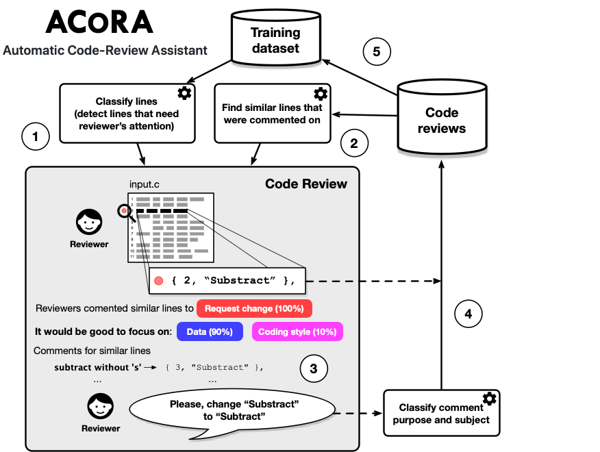

# ACoRA - Automatic Code-Review Assistant

ACoRA is a prototype toolset employing Machine Learning algorithms to support code reviews in Continous Integration.

## Installation

Download or clone the repository, open terminal in the root directory of the project and run the following command (if you are using conda or other Python virtualization tools, please remember to activate your virtual environment before):

```bash
pip install -e .
```

The installer should download and install or the required Python packages. However, please keep in mind that the required versions of the packages declared in the setup.py might be over-restrictive (you can try changing the versions and check whether the ACoRA tools execute properly).

## General usage scenario

ACoRA consists of a set of tools helping to build an automated pipeline supporting the code review process. They support data acquisition, models training, and classification. All of the scripts are located in the "scripts" folder. You can run each of them with the -h parameter to learn about the runtime parameter they accept. You can also check the "examples" folder to get examples of batch/bash runtime scripts.



The ACoRA process consists of the following activities presented in the figure above:

1. ACoRA detects a line that needs reviewer's attention.

2. ACoRA looks for similar lines that have been commented on in the past. It prepares a summary for the reviewer about those comments - what was the most frequent purpose of the comments (e.g., reviewers requested some changes, or asked some questions) and what were the subjects of the comment (e.g., some problems related to code logic, naming, code style).

3. The reviewer uses the provided information and decides to comment the line.

4. The comment and the commented line is stored in the code reviews database. The purpose and subjects of the comment are predicted using a classifier.

5. The information in the code reviews database can be used to train (or re-train) the classification models. In the case of comments, they should be manually classified (or at least the automated classification should be reviewed by a human expert). For the code lines, the process of determining the training dataset can be done automatically since we know which lines were commented on.

## Download reviews from Gerrit

The following scripts supporting downloading review-data from Gerrit are available:

* scripts/download_lines_from_gerrit.py - allows downloading lines of code for a given Gerrit query and storing them in a csv file

* scripts/download_commented_lines_from_gerrit.py - allows downloading lines of code and comments made by reviewers.

## Classify review comments

In order to guide the focus of reviewers, we need to understand what the comments in our historical database of reviews are about. We classify each of the comments by the comment "purpose" (e.g., to request a change or to trigger a discussion) and by the comment "subject" (e.g., the comment is about coding style).

ACoRA provides the following scripts supporting this process:

* scripts/train_bert_comments.py - this script is used to train a BERT-based classifier that simultaneously predicts the purpose and subject of a comment. Please keep it in mind that you need to download a pre-trained BERT model from https://github.com/google-research/bert. The trained model is saved to a file.

* scripts/test_bert_comments.py - this script allows testing the accuracy of predictions being made by the previously trained review-comments classification model on a given dataset. The script will generate plots and will report quality prediction metrics (e.g., accuracy, precision, recall).

* scripts/classify_comments.py - this script allows classifying new instances of comments using a previously trained review-comments classification model and stores the results to an xlsx or csv file.

## Pre-Train BERT for code

The following scripts allow training a BERT model for code:

* scripts/extract_code_lines_git.py - this script allows extracting lines of code from a Git repository and stores them in a json file (a list of of lists storing lines for each of the files separately). You can control from which commit the lines should be extracted and provide file extensions to be included in the processing.

* scripts/extract_vocab_from_code.py - this script extract BERT-like vocabulary from lines of code. It takes a path to a .json file containing lines of code (see extract_code_lines_git.py for more information) and saves the vocabulary to a .txt file.

* scripts/generate_code_line_pairs.py - this script generates files consisting of consecutive pairs of lines of code that are used to pre-train a BERT model for code (it requires a .json file with lines of code per each of the files - see extract_vocab_from_code.py for more information).  

* scripts/pretrain_bert_on_code.py - this is the final script to be used to pre-train a BERT model on code. It uses the vocabulary and a dataset of line-of-code pairs and outputs a trained model. Such a model can be used to extract line embeddings or can be used further as a basis for training specialized models.

## Train BERT for detecting lines that will likely be commented on

The following scripts allow to train a model for detecting lines that will be commented on:

* scripts/prepare_train_dataset_commented_lines.py - this script takes two files as an input: a file with entries about commented lines and a file with all lines. It goes through the commented lines and picks some non-commented lines from the same reviews (assuming that they are OK). You can control the ratio between the commented lines and non-commented lines in the dataset. The resulted dataset can be used to train and validate a BERT classification model.

* scripts/train_bert_commented_lines.py - this script takes the dataset prepared by the prepare_train_dataset_commented_lines.py script and a pretrained BERT on code model to fine tune it to be able to detect lines that will be commented on.

* scripts/test_bert_commented_lines.py - this script allows testing a trained BERT model on external datasets.

* scripts/classify_lines.py - this script allows to use a trained BERT model to detect lines that will be commented on.

## Find similar lines

The following scripts allow to provide recommendations for the reviewers on what they should focus on:

* scripts/lines_to_bert_embeddings.py - this script uses a given BERT model to extract lines embeddings and save it to a file.

* scripts/find_similar_lines.py - this script finds similar lines in the "database" to the provided lines (it requires line embeddings for the lines, see lines_to_bert_embeddings.py).

## Recommendations to the reviewers

* scripts/review_recommend.py - this script provides recommendations to the reviewers. It detects lines on which the reviewer should focus on and some hints concerning what to focus on.
